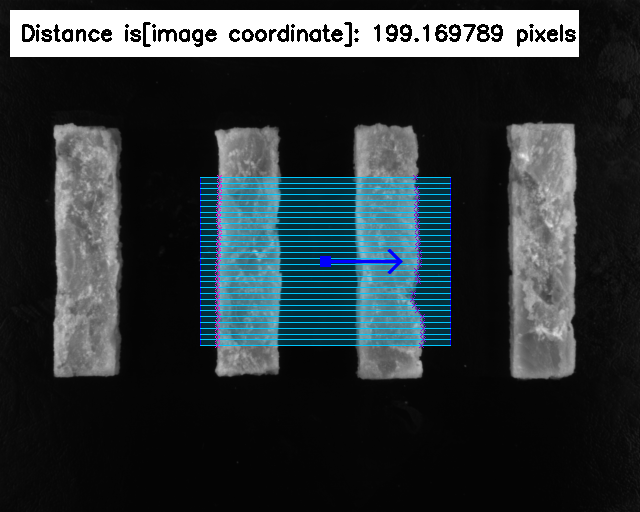

# Caliper_cpp
Caliper algorithm for dimension measurement

In `main.cpp` parameter description following

- caliper tool parameter description

```cpp
cv::Point2f p1(200, 261);
cv::Point2f p2(450, 261);
float height = 168;
int segment_num = 30;
```

as show in the figure


- algorithm parameter description

```c++
int cull_distance = 100;
double threshold_delta1 = 50;
int direction1 = 0;
double threshold_delta2 = 50;
int direction2 = 0;
```

- explain
  - cull_distance: Exclude distances [1-100]
  - direction1: Grayscale direction: 0-white to black 1-black to white (start chain)
  - threshold_delta1: Edge intensity [0-255] (start chain)
  - direction2: Grayscale direction: 0-white to black 1-black to white (end chain)
  - threshold_delta2: Edge intensity [0-255] (end chain)

## run the demo

> Follow command to build

```shell
mkdir build && cd build
cmake ..
make -j10
```

> Run

```shell
./Caliper
```

> Result


